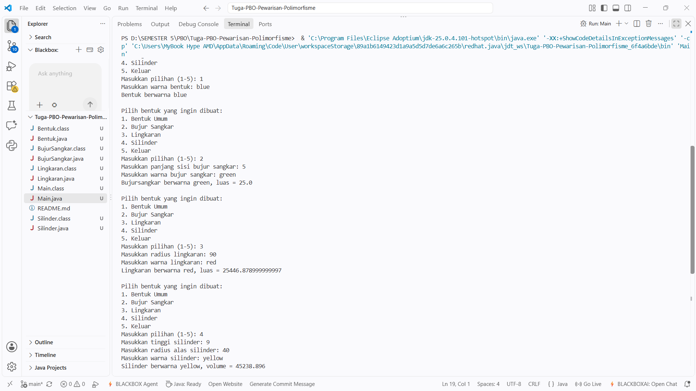

# Tugas PBO - Pewarisan dan Polimorfisme (Hierarki Kelas Geometri)

**Oleh:** Sri Zul'aini Ulya (F1D02410096)  
**Program Studi:** Teknik Informatika, Universitas Mataram  

## Deskripsi Proyek
Proyek ini adalah implementasi konsep **Inheritance** (Pewarisan) dan **Polymorphism** (Polimorfisme) dalam Pemrograman Berorientasi Objek (PBO) menggunakan bahasa Java. Program ini menyimulasikan hierarki bentuk geometri, di mana kelas-kelas turunan mewarisi sifat dari kelas induknya, namun dapat memodifikasi perilakunya (melalui *Method Overriding*).

## Struktur Kelas dan Konsep OOP
Program ini terdiri dari hierarki kelas berikut:
1. **`Bentuk` (Superclass):** Kelas dasar yang memiliki atribut `warna` dan metode `printInfo()`.
2. **`BujurSangkar` (Subclass dari Bentuk):** Mewarisi `Bentuk`, menambahkan atribut `sisi` dan metode `hitungLuas()`. Kelas ini melakukan *override* pada `printInfo()` untuk menampilkan informasi spesifik bujur sangkar.
3. **`Lingkaran` (Subclass dari Bentuk):** Mewarisi `Bentuk`, menambahkan atribut `radius` dan konstanta `PI`. Memiliki metode `hitungLuas()` dan melakukan *override* pada `printInfo()`.
4. **`Silinder` (Subclass dari Lingkaran):** Ini adalah contoh pewarisan bertingkat (*multilevel inheritance*). Mewarisi `Lingkaran`, menambahkan atribut `tinggi`, dan memiliki metode `hitungVolume()`. Kelas ini juga melakukan *override* `printInfo()`.
5. **`Main`:** Kelas *driver* interaktif yang menyediakan menu CLI untuk membuat instansiasi objek-objek di atas berdasarkan input pengguna.

---

## Penjelasan Hasil Output

Berikut adalah hasil eksekusi program `Main.java` pada terminal:

### Alur Eksekusi Berdasarkan Gambar:
Program menampilkan menu untuk memilih bentuk geometri yang ingin dibuat. Setiap opsi mendemonstrasikan pembentukan objek dan pemanggilan polimorfisme pada metode `printInfo()`.

1. **Membuat Bentuk Umum (Opsi 1):**
   * Pengguna menginputkan pilihan menu `1` dan memasukkan warna `blue`.
   * Sistem membuat objek `Bentuk` dan memanggil `printInfo()`.
   * **Output:** Menampilkan `Bentuk berwarna blue`. Ini adalah perilaku dasar dari superclass.

2. **Membuat Bujur Sangkar (Opsi 2):**
   * Pengguna menginputkan pilihan menu `2`.
   * Sistem meminta panjang sisi (input: `5`) dan warna (input: `green`).
   * Sistem membuat objek `BujurSangkar`. Metode `hitungLuas()` bekerja dengan mengalikan sisi (5 * 5 = 25.0). 
   * **Output:** Menampilkan `Bujursangkar berwarna green, luas = 25.0`. Ini mendemonstrasikan *method overriding*, di mana format output berubah disesuaikan dengan kelas anaknya.

3. **Membuat Lingkaran (Opsi 3):**
   * Pengguna menginputkan pilihan menu `3`.
   * Sistem meminta radius (input: `90`) dan warna (input: `red`).
   * Sistem menghitung luas berdasarkan rumus π × r² (3.14159 × 90 × 90).
   * **Output:** Menampilkan `Lingkaran berwarna red, luas = 25446.878999999997` (angka desimal panjang terjadi karena presisi *floating point* tipe data `double`).

4. **Membuat Silinder (Opsi 4):**
   * Pengguna menginputkan pilihan menu `4`.
   * Sistem meminta tinggi (input: `9`), radius alas (input: `40`), dan warna (input: `yellow`).
   * Sistem membuat objek `Silinder` yang memanggil konstruktor dari `Lingkaran` (*super*). Metode `hitungVolume()` bekerja dengan mengalikan luas alas dengan tinggi (Luas Lingkaran × 9).
   * **Output:** Menampilkan `Silinder berwarna yellow, volume = 45238.896`.
